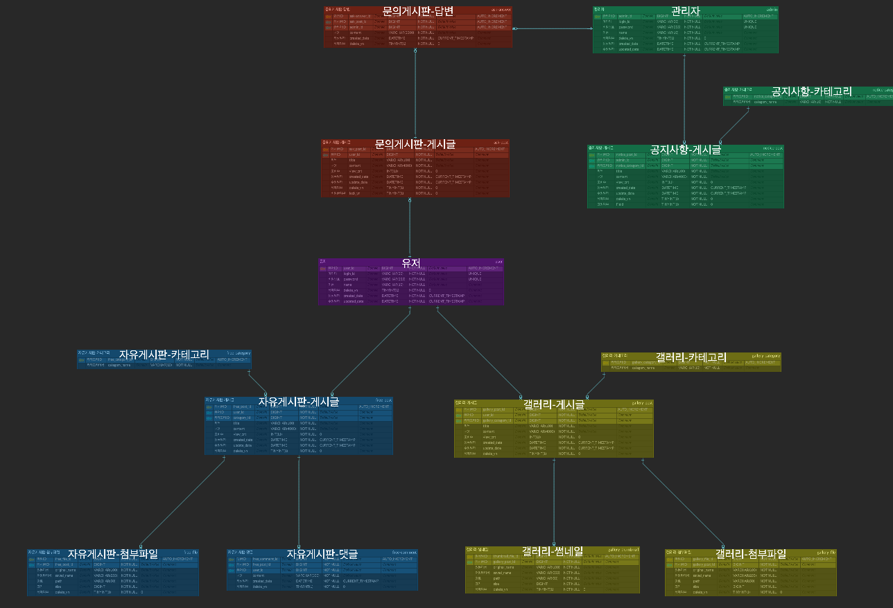

다중 게시판 프로젝트 유저 백엔드

일정 - 2024/09/02 ~ 2024/09/27

1주차 일정 - erd 및 테이블 생성(v), 화면 레이아웃 구성(v), 로그인/회원가입 로직및 api 구현(v), 자유게시판 로직및 api 구현(v)
2주차 일정 - 로그인/회원가입 화면 구현(v), 자유게시판 화면 구현(v), 갤러리 게시판 로직및 api 구현(x)
3주차 일정 - 갤러리 게시판 로직및 api 구현(v), 자유게시판 세부기능(v), 갤러리 게시판 화면 구현(v)
(ing)4주차 일정 - 갤러리 게시판 세부기능(x), 문의 게시판 완성(x), 공지 게시판 완성(x), 관리자 서버 로그인(x)

erd 구현
https://www.erdcloud.com/d/53KjJ8pm7RnSqyRcw
